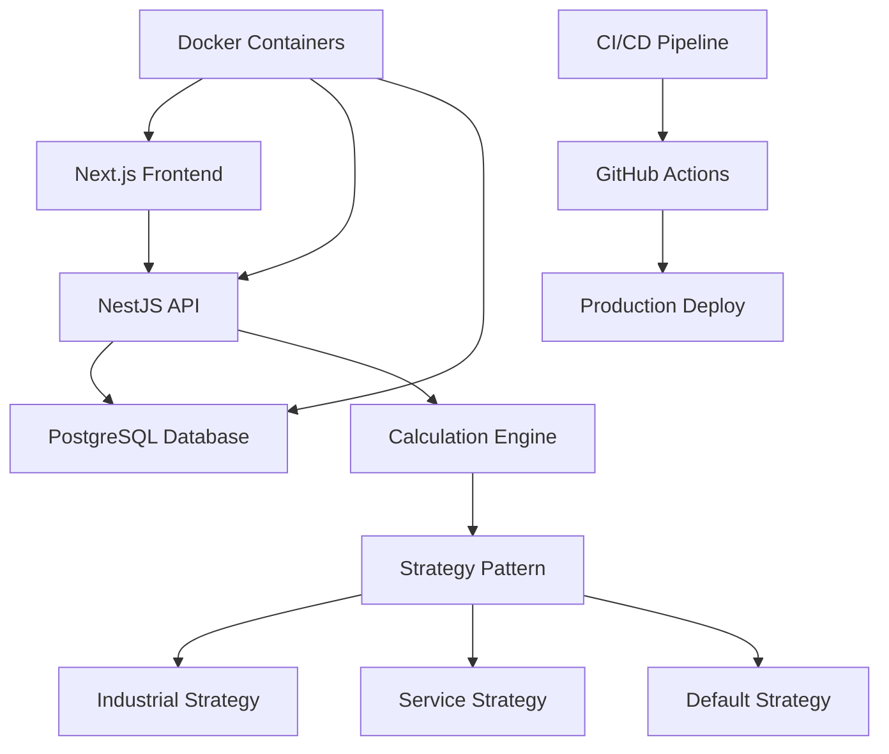
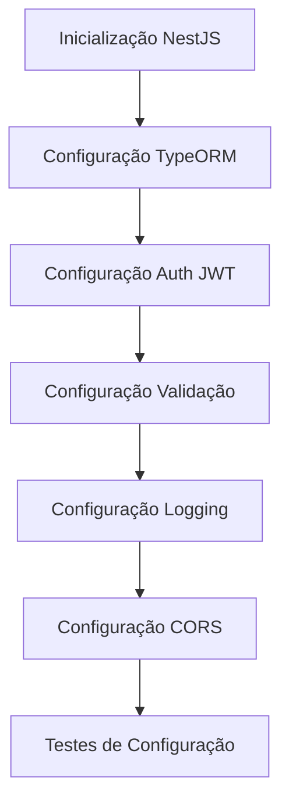
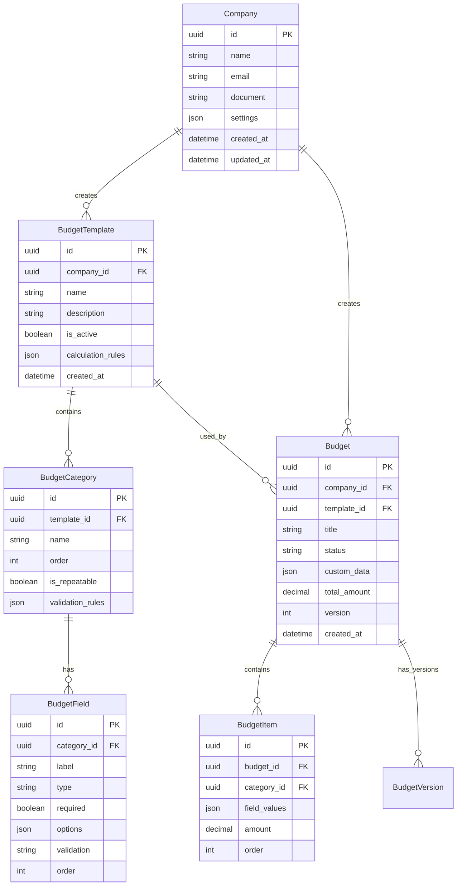
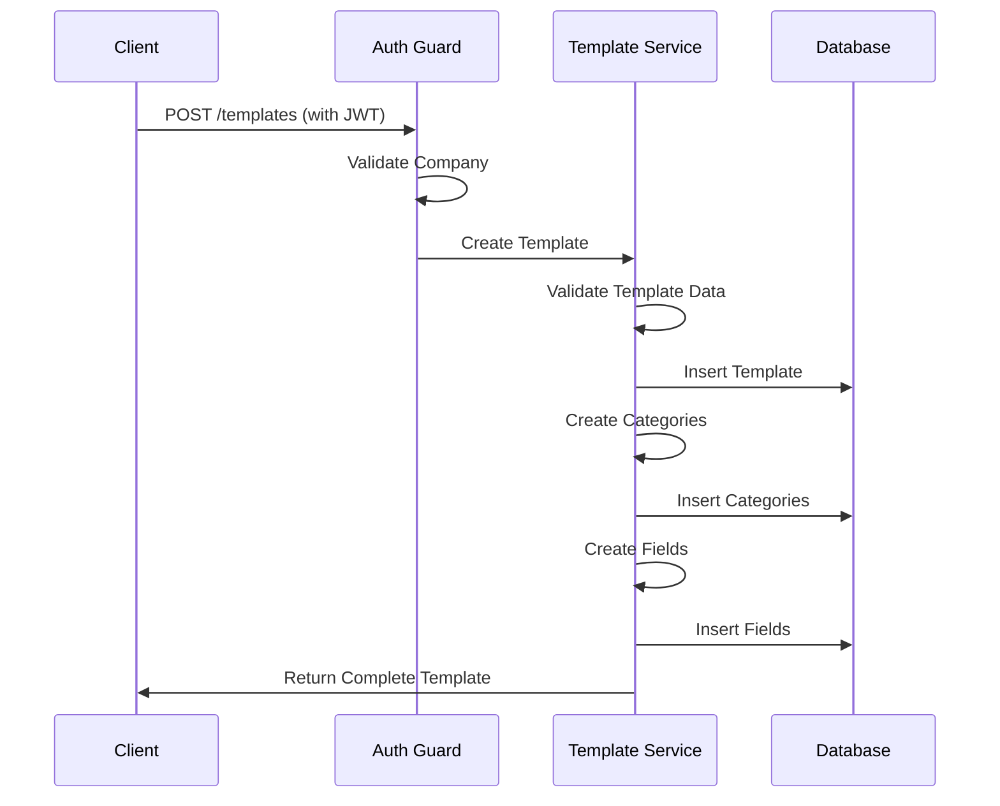
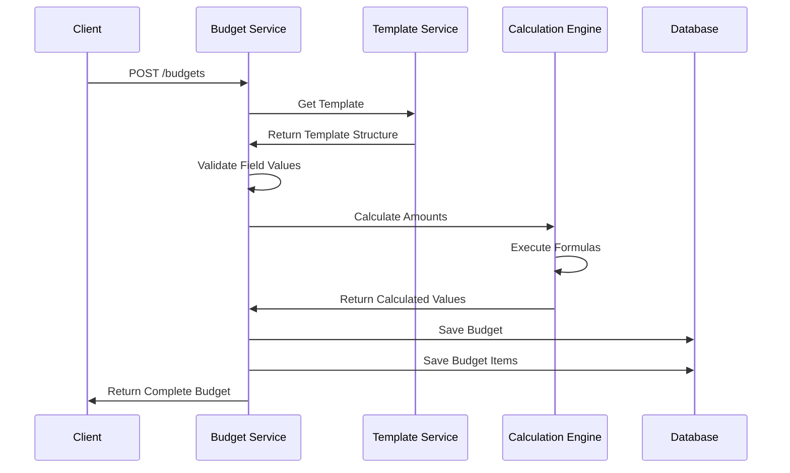
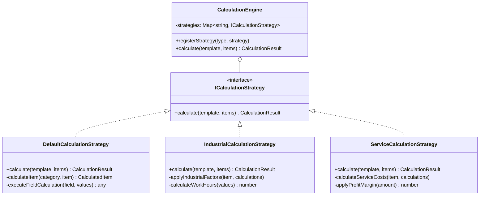
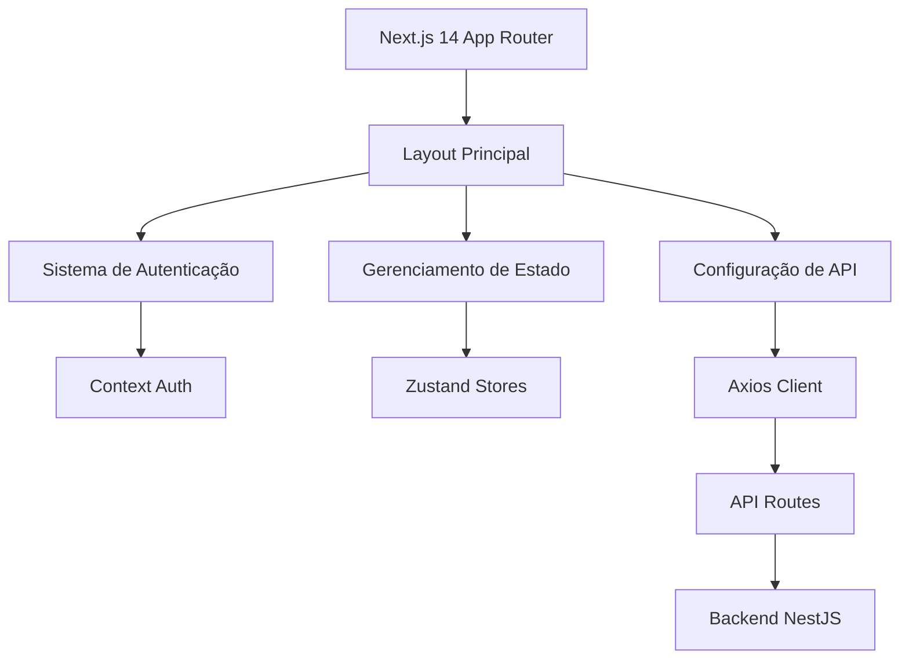
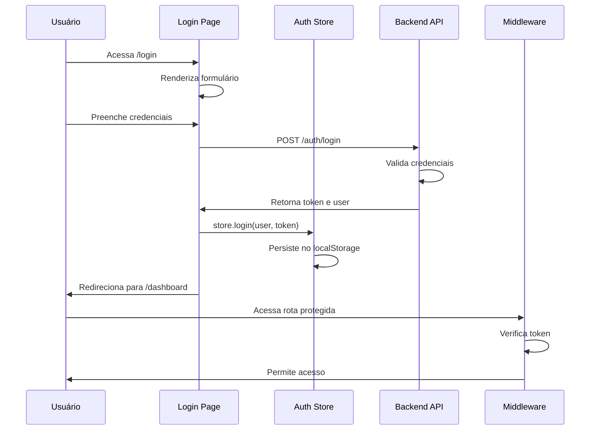
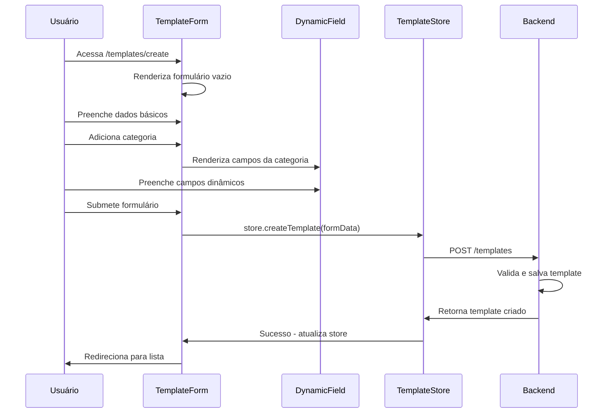
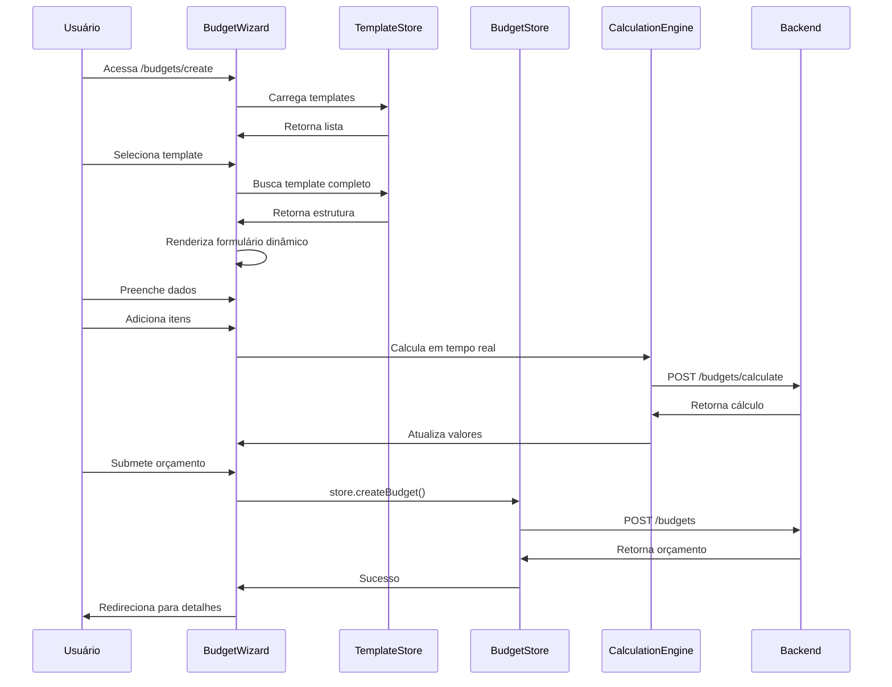

# 📊 Sistema de Orçamentos Flexível - Sprint 1

## 🎯 Visão Geral da Sprint

Esta Sprint 1 estabelece a base completa do sistema de orçamentos flexível, implementando todas as funcionalidades MVP necessárias para criação, gerenciamento e cálculo de orçamentos dinâmicos.

### 🚀 Objetivos Principais
- Configuração completa da arquitetura backend (NestJS) e frontend (Next.js)
- Sistema de templates dinâmicos com campos personalizáveis
- Motor de cálculos avançado com múltiplas estratégias
- Interface web responsiva e intuitiva
- Pipeline de deploy automatizado

---

## 🏗️ Arquitetura do Sistema



---

## 📋 Lista de Tarefas

### 🔧 Backend Tasks

#### 🎯 **TAREFA BE-01: CONFIGURAÇÃO INICIAL NESTJS**

**Descrição:** Configuração completa do projeto NestJS com arquitetura limpa, todas as dependências necessárias e estrutura de módulos organizada para escalabilidade.

**Fluxo de Configuração:**


**Estrutura de Pastas:**
```
backend/
├── src/
│   ├── common/
│   │   ├── decorators/
│   │   ├── filters/
│   │   ├── guards/
│   │   ├── interceptors/
│   │   └── pipes/
│   ├── config/
│   ├── database/
│   │   └── migrations/
│   ├── modules/
│   │   ├── auth/
│   │   ├── companies/
│   │   ├── templates/
│   │   └── budgets/
│   └── shared/
├── test/
├── package.json
└── docker-compose.yml
```

**Dependências Principais:**
```json
{
  "dependencies": {
    "@nestjs/common": "^10.0.0",
    "@nestjs/core": "^10.0.0",
    "@nestjs/jwt": "^10.1.0",
    "@nestjs/passport": "^10.0.0",
    "@nestjs/platform-express": "^10.0.0",
    "@nestjs/typeorm": "^10.0.0",
    "typeorm": "^0.3.17",
    "pg": "^8.11.0",
    "class-validator": "^0.14.0",
    "class-transformer": "^0.5.1",
    "bcryptjs": "^2.4.3",
    "config": "^3.3.9"
  }
}
```

**Configuração TypeORM:**
```typescript
// src/config/database.config.ts
import { TypeOrmModuleOptions } from '@nestjs/typeorm';
import { ConfigService } from '@nestjs/config';

export const typeOrmConfig = (
  configService: ConfigService,
): TypeOrmModuleOptions => ({
  type: 'postgres',
  host: configService.get('DB_HOST', 'localhost'),
  port: configService.get('DB_PORT', 5432),
  username: configService.get('DB_USERNAME', 'postgres'),
  password: configService.get('DB_PASSWORD', 'password'),
  database: configService.get('DB_NAME', 'budget_system'),
  entities: [__dirname + '/../**/*.entity{.ts,.js}'],
  synchronize: configService.get('NODE_ENV') !== 'production',
  logging: configService.get('NODE_ENV') !== 'production',
  migrations: [__dirname + '/../database/migrations/*{.ts,.js}'],
  migrationsRun: true,
});
```

**Critérios de Aceitação:**
- [ ] Projeto inicializa com `npm run start:dev` sem erros
- [ ] Conexão com PostgreSQL estabelecida com sucesso
- [ ] Endpoint `/health` retorna status 200
- [ ] Validação rejeita dados inválidos
- [ ] JWT token é gerado e validado corretamente
- [ ] Logs estruturados sendo gerados
- [ ] CORS configurado para frontend

---

#### 🎯 **TAREFA BE-02: MODELAGEM DE DADOS E ENTIDADES**

**Diagrama de Entidades:**


**Entidades Principais:**

1. **Company Entity:**
```typescript
@Entity('companies')
export class Company {
  @PrimaryGeneratedColumn('uuid')
  id: string;

  @Column({ length: 255 })
  name: string;

  @Column({ length: 255, unique: true })
  email: string;

  @Column({ length: 20, nullable: true })
  document: string;

  @Column('jsonb', { default: {} })
  settings: Record<string, any>;

  @OneToMany(() => BudgetTemplate, template => template.company)
  templates: BudgetTemplate[];

  @OneToMany(() => Budget, budget => budget.company)
  budgets: Budget[];

  @CreateDateColumn()
  created_at: Date;

  @UpdateDateColumn()
  updated_at: Date;
}
```

2. **BudgetTemplate Entity:**
```typescript
@Entity('budget_templates')
export class BudgetTemplate {
  @PrimaryGeneratedColumn('uuid')
  id: string;

  @Column()
  name: string;

  @Column('text', { nullable: true })
  description: string;

  @Column({ default: true })
  is_active: boolean;

  @Column('jsonb', { default: {} })
  calculation_rules: {
    formula: string;
    variables: string[];
    conditions: any[];
  };

  @ManyToOne(() => Company, company => company.templates)
  @JoinColumn({ name: 'company_id' })
  company: Company;

  @Column()
  company_id: string;

  @OneToMany(() => BudgetCategory, category => category.template, { cascade: true })
  categories: BudgetCategory[];

  @CreateDateColumn()
  created_at: Date;
}
```

**Critérios de Aceitação:**
- [ ] Todas as entidades criadas com decorators TypeORM
- [ ] Relacionamentos configurados corretamente
- [ ] Migrations aplicadas sem erros no PostgreSQL
- [ ] Seeds básicos criados para teste
- [ ] Consultas básicas funcionando (CRUD)
- [ ] Validações de campos aplicadas

---

#### 🎯 **TAREFA BE-03: MÓDULO DE TEMPLATES DE ORÇAMENTO**

**Fluxo de Criação de Template:**


**DTOs e Validações:**
```typescript
export class CreateTemplateDto {
  @IsString()
  @MinLength(3)
  @MaxLength(255)
  name: string;

  @IsString()
  @IsOptional()
  description?: string;

  @IsArray()
  @ValidateNested({ each: true })
  @Type(() => CreateCategoryDto)
  categories: CreateCategoryDto[];

  @IsObject()
  @IsOptional()
  calculation_rules?: Record<string, any>;
}

export class CreateCategoryDto {
  @IsString()
  @MinLength(2)
  name: string;

  @IsNumber()
  @Min(0)
  order: number;

  @IsBoolean()
  @IsOptional()
  is_repeatable?: boolean;

  @IsArray()
  @ValidateNested({ each: true })
  @Type(() => CreateFieldDto)
  fields: CreateFieldDto[];
}
```

**Service com Lógica de Negócio:**
```typescript
@Injectable()
export class TemplateService {
  constructor(
    @InjectRepository(BudgetTemplate)
    private templateRepository: Repository<BudgetTemplate>,
    @InjectRepository(BudgetCategory)
    private categoryRepository: Repository<BudgetCategory>,
    @InjectRepository(BudgetField)
    private fieldRepository: Repository<BudgetField>,
  ) {}

  async createTemplate(
    companyId: string,
    createTemplateDto: CreateTemplateDto,
  ): Promise<BudgetTemplate> {
    return this.templateRepository.manager.transaction(async (manager) => {
      // Criar template
      const template = manager.create(BudgetTemplate, {
        company_id: companyId,
        name: createTemplateDto.name,
        description: createTemplateDto.description,
        calculation_rules: createTemplateDto.calculation_rules || {},
      });

      const savedTemplate = await manager.save(template);

      // Criar categorias e campos
      for (const categoryDto of createTemplateDto.categories) {
        const category = manager.create(BudgetCategory, {
          template_id: savedTemplate.id,
          name: categoryDto.name,
          order: categoryDto.order,
          is_repeatable: categoryDto.is_repeatable || false,
          validation_rules: {},
        });

        const savedCategory = await manager.save(category);

        // Criar campos da categoria
        const fieldEntities = categoryDto.fields.map(fieldDto =>
          manager.create(BudgetField, {
            category_id: savedCategory.id,
            label: fieldDto.label,
            type: fieldDto.type,
            required: fieldDto.required || false,
            options: fieldDto.options,
            validation: fieldDto.validation,
            order: fieldDto.order,
            calculation: fieldDto.calculation || {
              is_calculated: false,
              formula: '',
              depends_on: [],
            },
          })
        );

        await manager.save(BudgetField, fieldEntities);
      }

      // Retornar template completo
      return manager.findOne(BudgetTemplate, {
        where: { id: savedTemplate.id },
        relations: ['categories', 'categories.fields'],
      });
    });
  }
}
```

**Endpoints Completos:**
| Método | Endpoint | Descrição | Body | Parâmetros |
|--------|----------|-----------|------|------------|
| POST | /templates | Criar template | CreateTemplateDto | - |
| GET | /templates | Listar templates | - | ?search=&is_active=&page=&limit= |
| GET | /templates/:id | Buscar template | - | id |
| PUT | /templates/:id | Atualizar template | UpdateTemplateDto | id |
| DELETE | /templates/:id | Deletar template | - | id |

**Critérios de Aceitação:**
- [ ] Template criado com categorias e campos
- [ ] Validações aplicadas em todos os DTOs
- [ ] Filtros de busca funcionando
- [ ] Transação garantindo consistência
- [ ] Testes unitários com >80% cobertura
- [ ] Documentação Swagger gerada

---

#### 🎯 **TAREFA BE-04: MÓDULO DE ORÇAMENTOS**

**Fluxo de Criação de Orçamento:**


**DTOs de Orçamento:**
```typescript
export class CreateBudgetDto {
  @IsString()
  @IsUUID()
  template_id: string;

  @IsString()
  @MinLength(3)
  title: string;

  @IsArray()
  @ValidateNested({ each: true })
  @Type(() => BudgetItemDto)
  items: BudgetItemDto[];
}

export class BudgetItemDto {
  @IsString()
  @IsUUID()
  category_id: string;

  @IsObject()
  field_values: Record<string, any>;

  @IsNumber()
  @Min(0)
  order: number;
}
```

**Budget Service Completo:**
```typescript
@Injectable()
export class BudgetService {
  constructor(
    @InjectRepository(Budget)
    private budgetRepository: Repository<Budget>,
    @InjectRepository(BudgetItem)
    private itemRepository: Repository<BudgetItem>,
    private templateService: TemplateService,
    private calculationEngine: CalculationEngine,
  ) {}

  async createBudget(
    companyId: string,
    createBudgetDto: CreateBudgetDto,
  ): Promise<Budget> {
    // Buscar template
    const template = await this.templateService.findTemplateById(
      createBudgetDto.template_id,
      companyId,
    );

    if (!template) {
      throw new NotFoundException('Template não encontrado');
    }

    // Validar campos obrigatórios
    this.validateBudgetItems(template, createBudgetDto.items);

    // Calcular valores
    const calculationResult = await this.calculationEngine.calculate(
      template,
      createBudgetDto.items,
    );

    // Salvar orçamento
    return this.budgetRepository.manager.transaction(async (manager) => {
      const budget = manager.create(Budget, {
        company_id: companyId,
        template_id: createBudgetDto.template_id,
        title: createBudgetDto.title,
        total_amount: calculationResult.total,
        status: BudgetStatus.DRAFT,
        custom_data: {
          subtotals: calculationResult.subtotals,
        },
      });

      const savedBudget = await manager.save(budget);

      // Salvar items
      const budgetItems = calculationResult.items.map(item =>
        manager.create(BudgetItem, {
          budget_id: savedBudget.id,
          category_id: item.category_id,
          field_values: item.field_values,
          amount: item.amount,
          order: item.order,
        })
      );

      await manager.save(BudgetItem, budgetItems);

      return this.findBudgetById(savedBudget.id, companyId);
    });
  }
}
```

**Critérios de Aceitação:**
- [ ] Orçamento criado com validação de campos
- [ ] Cálculos executados corretamente
- [ ] Strategy pattern implementado para diferentes tipos de cálculo
- [ ] Transações garantindo consistência
- [ ] Filtros e paginação funcionando
- [ ] Testes com cenários complexos de cálculo

---

#### 🎯 **TAREFA BE-05: SISTEMA DE CÁLCULOS E ESTRATÉGIAS**

**Arquitetura do Motor de Cálculos:**


**Interface Base:**
```typescript
export interface ICalculationStrategy {
  readonly type: string;
  
  calculate(
    template: BudgetTemplate,
    items: BudgetItemDto[],
    context?: CalculationContext,
  ): Promise<CalculationResult>;

  validate(
    template: BudgetTemplate,
    items: BudgetItemDto[],
  ): Promise<ValidationResult>;
}

export interface CalculationContext {
  company_id: string;
  currency: string;
  tax_rules: TaxRule[];
  custom_rates?: Record<string, number>;
}
```

**Motor de Cálculos Principal:**
```typescript
@Injectable()
export class CalculationEngine {
  private strategies: Map<string, ICalculationStrategy> = new Map();

  constructor(
    private configService: ConfigService,
    @Inject(forwardRef(() => DefaultCalculationStrategy))
    private defaultStrategy: DefaultCalculationStrategy,
    @Inject(forwardRef(() => IndustrialCalculationStrategy))
    private industrialStrategy: IndustrialCalculationStrategy,
    @Inject(forwardRef(() => ServiceCalculationStrategy))
    private serviceStrategy: ServiceCalculationStrategy,
  ) {
    this.registerStrategy('default', defaultStrategy);
    this.registerStrategy('industrial', industrialStrategy);
    this.registerStrategy('service', serviceStrategy);
  }

  async calculate(
    template: BudgetTemplate,
    items: BudgetItemDto[],
    companyId: string,
  ): Promise<CalculationResult> {
    // Determinar estratégia baseada no template
    const strategyType = this.determineStrategy(template);
    const strategy = this.strategies.get(strategyType) || this.defaultStrategy;

    // Criar contexto de cálculo
    const context = await this.createCalculationContext(companyId, template);

    // Validar antes de calcular
    const validation = await strategy.validate(template, items);
    if (!validation.isValid) {
      throw new BadRequestException({
        message: 'Erro de validação nos dados do orçamento',
        errors: validation.errors,
        warnings: validation.warnings,
      });
    }

    // Executar cálculo
    return strategy.calculate(template, items, context);
  }
}
```

**Estratégia Industrial:**
```typescript
@Injectable()
export class IndustrialCalculationStrategy implements ICalculationStrategy {
  readonly type = 'industrial';

  async calculate(
    template: BudgetTemplate,
    items: BudgetItemDto[],
    context: CalculationContext,
  ): Promise<CalculationResult> {
    const calculatedItems: CalculatedItem[] = [];
    const categoryTotals: Map<string, number> = new Map();
    let grandTotal = 0;

    for (const item of items) {
      const category = template.categories.find(c => c.id === item.category_id);
      if (!category) continue;

      const calculatedItem = await this.calculateIndustrialItem(
        category,
        item,
        context,
      );
      
      calculatedItems.push(calculatedItem);

      // Acumular totais por categoria
      const categoryTotal = categoryTotals.get(category.id) || 0;
      categoryTotals.set(category.id, categoryTotal + calculatedItem.amount);
      
      grandTotal += calculatedItem.amount;
    }

    // Aplicar impostos e margens industriais
    const taxedTotal = this.applyIndustrialTaxes(grandTotal, context);
    const finalTotal = this.applyProfitMargin(taxedTotal, context);

    return {
      items: calculatedItems,
      total: finalTotal,
      subtotals: this.calculateIndustrialSubtotals(categoryTotals, template),
      metadata: {
        base_total: grandTotal,
        taxes: finalTotal - grandTotal,
        category_breakdown: Object.fromEntries(categoryTotals),
      },
    };
  }
}
```

**Critérios de Aceitação:**
- [ ] Strategy pattern implementado corretamente
- [ ] Múltiplas estratégias de cálculo funcionando
- [ ] Detecção automática de estratégia baseada no template
- [ ] Validações específicas por tipo de cálculo
- [ ] Cálculos complexos com fórmulas executando corretamente
- [ ] Aplicação de impostos e margens configuráveis
- [ ] Testes unitários cobrindo todos os cenários de cálculo

---

### 🖥️ Frontend Tasks

#### 🎯 **TAREFA FE-01: CONFIGURAÇÃO DO PROJETO NEXT.JS**

**Arquitetura do Frontend:**


**Estrutura de Pastas:**
```
frontend/
├── src/
│   ├── app/
│   │   ├── (auth)/
│   │   │   ├── login/
│   │   │   └── register/
│   │   ├── (dashboard)/
│   │   │   ├── templates/
│   │   │   ├── budgets/
│   │   │   └── companies/
│   │   ├── api/
│   │   ├── globals.css
│   │   ├── layout.tsx
│   │   └── page.tsx
│   ├── components/
│   │   ├── ui/
│   │   ├── layout/
│   │   ├── forms/
│   │   └── budget/
│   ├── lib/
│   │   ├── utils.ts
│   │   ├── api.ts
│   │   └── store/
│   ├── hooks/
│   ├── types/
│   └── styles/
```

**Package.json com Dependências:**
```json
{
  "dependencies": {
    "next": "14.0.0",
    "react": "^18.2.0",
    "react-dom": "^18.2.0",
    "axios": "^1.5.0",
    "zustand": "^4.4.0",
    "react-hook-form": "^7.45.0",
    "@hookform/resolvers": "^3.3.0",
    "zod": "^3.22.0",
    "lucide-react": "^0.288.0",
    "clsx": "^2.0.0",
    "tailwind-merge": "^1.14.0",
    "date-fns": "^2.30.0",
    "react-query": "^3.39.3"
  }
}
```

**Cliente API Configurado:**
```typescript
// src/lib/api.ts
import axios from 'axios';

const API_BASE_URL = process.env.NEXT_PUBLIC_API_URL || 'http://localhost:3001';

export const api = axios.create({
  baseURL: `${API_BASE_URL}/api`,
  timeout: 10000,
  headers: {
    'Content-Type': 'application/json',
  },
});

// Request interceptor para adicionar token
api.interceptors.request.use(
  (config) => {
    const token = localStorage.getItem('auth_token');
    if (token) {
      config.headers.Authorization = `Bearer ${token}`;
    }
    return config;
  },
  (error) => {
    return Promise.reject(error);
  }
);

// Response interceptor para tratar erros
api.interceptors.response.use(
  (response) => response,
  (error) => {
    if (error.response?.status === 401) {
      localStorage.removeItem('auth_token');
      window.location.href = '/login';
    }
    return Promise.reject(error);
  }
);
```

**Critérios de Aceitação:**
- [ ] Projeto Next.js inicializado com App Router
- [ ] TypeScript configurado com paths
- [ ] Tailwind CSS funcionando com tema customizado
- [ ] Cliente API configurado com interceptors
- [ ] Sistema de store com Zustand implementado
- [ ] Layout principal com sidebar responsivo
- [ ] Sistema de autenticação base configurado
- [ ] Build sem erros e deploy funcionando

---

#### 🎯 **TAREFA FE-02: SISTEMA DE AUTENTICAÇÃO E LAYOUT**

**Fluxo de Autenticação:**


**Hook de Autenticação:**
```typescript
// src/hooks/use-auth.ts
import { useAuthStore } from '@/lib/store/auth-store';
import { api } from '@/lib/api';
import { useEffect, useState } from 'react';

export function useAuth() {
  const { user, token, isAuthenticated, login, logout, setUser } = useAuthStore();
  const [loading, setLoading] = useState(true);

  // Verificar autenticação ao carregar
  useEffect(() => {
    checkAuth();
  }, []);

  const checkAuth = async () => {
    const storedToken = localStorage.getItem('auth_token');
    
    if (!storedToken) {
      setLoading(false);
      return;
    }

    try {
      const response = await api.get('/auth/me');
      setUser(response.data.data);
    } catch (error) {
      logout();
    } finally {
      setLoading(false);
    }
  };

  const signIn = async (credentials: { email: string; password: string }) => {
    try {
      const response = await api.post('/auth/login', credentials);
      const { user, token } = response.data.data;
      
      login(user, token);
      return { success: true };
    } catch (error: any) {
      return { 
        success: false, 
        error: error.response?.data?.message || 'Erro ao fazer login' 
      };
    }
  };

  return {
    user,
    token,
    isAuthenticated,
    loading,
    signIn,
    signOut: logout,
    checkAuth,
  };
}
```

**Middleware de Autenticação:**
```typescript
// middleware.ts
import { NextResponse } from 'next/server';
import type { NextRequest } from 'next/server';

const publicRoutes = ['/login', '/register', '/forgot-password'];
const authRoutes = ['/login', '/register'];

export function middleware(request: NextRequest) {
  const { pathname } = request.nextUrl;
  const token = request.cookies.get('auth_token')?.value;

  // Verificar se é rota pública
  const isPublicRoute = publicRoutes.includes(pathname);
  const isAuthRoute = authRoutes.includes(pathname);

  // Se não tem token e não é rota pública, redirecionar para login
  if (!token && !isPublicRoute) {
    const loginUrl = new URL('/login', request.url);
    loginUrl.searchParams.set('callbackUrl', pathname);
    return NextResponse.redirect(loginUrl);
  }

  // Se tem token e está em rota de auth, redirecionar para dashboard
  if (token && isAuthRoute) {
    return NextResponse.redirect(new URL('/', request.url));
  }

  return NextResponse.next();
}
```

**Critérios de Aceitação:**
- [ ] Sistema de login funcionando com validação
- [ ] Middleware protegendo rotas
- [ ] Header com informações do usuário
- [ ] Dashboard com estatísticas e orçamentos recentes
- [ ] Logout funcionando corretamente
- [ ] Persistência de sessão no localStorage
- [ ] Redirecionamentos corretos após login/logout
- [ ] Interface responsiva e acessível

---

#### 🎯 **TAREFA FE-03: GERENCIAMENTO DE TEMPLATES**

**Fluxo de Criação de Template:**


**Store de Templates:**
```typescript
// src/lib/store/template-store.ts
import { create } from 'zustand';
import { api, apiEndpoints } from '@/lib/api';
import { BudgetTemplate, CreateTemplateDto } from '@/types/budget';

interface TemplateState {
  templates: BudgetTemplate[];
  currentTemplate: BudgetTemplate | null;
  loading: boolean;
  error: string | null;
  
  // Actions
  fetchTemplates: () => Promise<void>;
  fetchTemplate: (id: string) => Promise<void>;
  createTemplate: (data: CreateTemplateDto) => Promise<BudgetTemplate>;
  updateTemplate: (id: string, data: Partial<BudgetTemplate>) => Promise<BudgetTemplate>;
  deleteTemplate: (id: string) => Promise<void>;
}

export const useTemplateStore = create<TemplateState>((set, get) => ({
  templates: [],
  currentTemplate: null,
  loading: false,
  error: null,
  
  fetchTemplates: async () => {
    set({ loading: true, error: null });
    try {
      const response = await api.get(apiEndpoints.templates.list);
      set({ 
        templates: response.data.data,
        loading: false 
      });
    } catch (error: any) {
      set({ 
        error: error.response?.data?.message || 'Erro ao carregar templates',
        loading: false 
      });
    }
  },
  
  createTemplate: async (data: CreateTemplateDto) => {
    set({ loading: true, error: null });
    try {
      const response = await api.post(apiEndpoints.templates.create, data);
      const newTemplate = response.data.data;
      
      // Atualizar lista
      const { templates } = get();
      set({ 
        templates: [...templates, newTemplate],
        loading: false 
      });
      
      return newTemplate;
    } catch (error: any) {
      const errorMessage = error.response?.data?.message || 'Erro ao criar template';
      set({ error: errorMessage, loading: false });
      throw new Error(errorMessage);
    }
  },
}));
```

**Critérios de Aceitação:**
- [ ] Lista de templates com busca e filtros
- [ ] Formulário de criação com drag & drop
- [ ] Validação de dados em tempo real
- [ ] Categorias e campos dinâmicos funcionando
- [ ] Campos calculados com fórmulas
- [ ] Interface responsiva e intuitiva
- [ ] Tratamento de erros adequado
- [ ] Redirecionamento após criação

---

#### 🎯 **TAREFA FE-04: CRIAÇÃO DE ORÇAMENTOS**

**Fluxo de Criação de Orçamento:**


**Wizard de Criação:**
```typescript
// src/app/(dashboard)/budgets/create/page.tsx
export default function CreateBudgetPage() {
  const [step, setStep] = useState(1);
  const [selectedTemplate, setSelectedTemplate] = useState<string>('');
  const [budgetData, setBudgetData] = useState({
    title: '',
    template_id: '',
  });
  const [items, setItems] = useState<BudgetItemForm[]>([]);
  const [calculation, setCalculation] = useState<any>(null);

  // Calcular orçamento quando items mudam
  useEffect(() => {
    if (items.length > 0 && templateData) {
      calculateBudgetItems();
    }
  }, [items, templateData]);

  const calculateBudgetItems = async () => {
    try {
      const result = await calculateBudget({
        template_id: templateData.id,
        items: items,
      });
      setCalculation(result);
    } catch (error) {
      console.error('Erro no cálculo:', error);
    }
  };

  return (
    <div className="space-y-6">
      {/* Progress Steps */}
      <div className="flex items-center space-x-4">
        <div className={`flex items-center ${step >= 1 ? 'text-blue-600' : 'text-gray-400'}`}>
          <div className={`w-8 h-8 rounded-full flex items-center justify-center border-2 ${
            step >= 1 ? 'bg-blue-600 border-blue-600 text-white' : 'border-gray-300'
          }`}>
            1
          </div>
          <span className="ml-2 font-medium">Template</span>
        </div>
        <div className={`flex-1 h-1 ${step >= 2 ? 'bg-blue-600' : 'bg-gray-200'}`} />
        <div className={`flex items-center ${step >= 2 ? 'text-blue-600' : 'text-gray-400'}`}>
          <div className={`w-8 h-8 rounded-full flex items-center justify-center border-2 ${
            step >= 2 ? 'bg-blue-600 border-blue-600 text-white' : 'border-gray-300'
          }`}>
            2
          </div>
          <span className="ml-2 font-medium">Itens</span>
        </div>
      </div>

      <form onSubmit={handleSubmit}>
        {step === 1 && renderStep1()}
        {step === 2 && renderStep2()}
      </form>
    </div>
  );
}
```

**Critérios de Aceitação:**
- [ ] Wizard multi-step funcionando
- [ ] Seleção de template com preview
- [ ] Formulário dinâmico baseado no template
- [ ] Cálculos em tempo real
- [ ] Adição/remoção de itens em categorias repetíveis
- [ ] Validação de campos obrigatórios
- [ ] Preview do orçamento com totais
- [ ] Interface responsiva e intuitiva

---

#### 🎯 **TAREFA FE-05: LISTAGEM E VISUALIZAÇÃO DE ORÇAMENTOS**

**Lista de Orçamentos:**
```typescript
// src/app/(dashboard)/budgets/page.tsx
export default function BudgetsPage() {
  const { budgets, loading, error, fetchBudgets } = useBudgetStore();
  const [search, setSearch] = useState('');
  const [statusFilter, setStatusFilter] = useState('');

  const filteredBudgets = budgets.filter(budget => {
    const matchesSearch = budget.title.toLowerCase().includes(search.toLowerCase());
    const matchesStatus = !statusFilter || budget.status === statusFilter;
    return matchesSearch && matchesStatus;
  });

  return (
    <div className="space-y-6">
      <Card>
        <CardHeader>
          <div className="flex items-center justify-between">
            <CardTitle>Lista de Orçamentos</CardTitle>
            <div className="flex items-center space-x-4">
              <Select value={statusFilter} onValueChange={setStatusFilter}>
                <SelectTrigger className="w-40">
                  <SelectValue placeholder="Status" />
                </SelectTrigger>
                <SelectContent>
                  <SelectItem value="">Todos</SelectItem>
                  <SelectItem value="draft">Rascunho</SelectItem>
                  <SelectItem value="sent">Enviado</SelectItem>
                  <SelectItem value="approved">Aprovado</SelectItem>
                </SelectContent>
              </Select>
              <Input
                placeholder="Buscar orçamentos..."
                value={search}
                onChange={(e) => setSearch(e.target.value)}
                className="w-64"
              />
            </div>
          </div>
        </CardHeader>
        <CardContent>
          <Table>
            <TableHeader>
              <TableRow>
                <TableHead>Título</TableHead>
                <TableHead>Template</TableHead>
                <TableHead>Status</TableHead>
                <TableHead>Valor Total</TableHead>
                <TableHead>Criado em</TableHead>
                <TableHead>Ações</TableHead>
              </TableRow>
            </TableHeader>
            <TableBody>
              {filteredBudgets.map((budget) => (
                <TableRow key={budget.id}>
                  <TableCell>
                    <Link href={`/budgets/${budget.id}`}>
                      {budget.title}
                    </Link>
                  </TableCell>
                  <TableCell>
                    <Badge variant="outline">
                      {budget.template?.name}
                    </Badge>
                  </TableCell>
                  <TableCell>
                    <Badge variant={getStatusVariant(budget.status)}>
                      {getStatusText(budget.status)}
                    </Badge>
                  </TableCell>
                  <TableCell>
                    R$ {budget.total_amount.toFixed(2)}
                  </TableCell>
                  <TableCell>
                    {new Date(budget.created_at).toLocaleDateString('pt-BR')}
                  </TableCell>
                  <TableCell>
                    {/* Actions dropdown */}
                  </TableCell>
                </TableRow>
              ))}
            </TableBody>
          </Table>
        </CardContent>
      </Card>
    </div>
  );
}
```

**Critérios de Aceitação:**
- [ ] Lista de orçamentos com busca e filtros por status
- [ ] Página de detalhes com informações completas
- [ ] Atualização de status em tempo real
- [ ] Visualização de itens com valores formatados
- [ ] Resumo financeiro com cálculos
- [ ] Botões de ação (editar, exportar, etc.)
- [ ] Interface responsiva
- [ ] Tratamento de estados de loading e erro

---

### 🗄️ Database Tasks

#### 🎯 **TAREFA DB-01: CONFIGURAÇÃO DO POSTGRESQL**

**Configuração Docker Detalhada:**
```yaml
# docker-compose.yml
version: '3.8'

services:
  postgres:
    image: postgres:15
    container_name: budget_system_db
    environment:
      POSTGRES_DB: budget_system
      POSTGRES_USER: budget_user
      POSTGRES_PASSWORD: budget_password
    ports:
      - "5432:5432"
    volumes:
      - postgres_data:/var/lib/postgresql/data
      - ./database/init:/docker-entrypoint-initdb.d
    networks:
      - budget_network

  pgadmin:
    image: dpage/pgadmin4
    container_name: budget_pgadmin
    environment:
      PGADMIN_DEFAULT_EMAIL: admin@budgetsystem.com
      PGADMIN_DEFAULT_PASSWORD: admin123
    ports:
      - "8080:80"
    networks:
      - budget_network
    depends_on:
      - postgres

volumes:
  postgres_data:

networks:
  budget_network:
    driver: bridge
```

**Scripts de Inicialização:**
```sql
-- database/init/01-init.sql
CREATE EXTENSION IF NOT EXISTS "uuid-ossp";

-- Configurações do banco
SET timezone = 'America/Sao_Paulo';

-- Criar índices para performance
CREATE INDEX IF NOT EXISTS idx_budgets_company_status ON budgets(company_id, status);
CREATE INDEX IF NOT EXISTS idx_budgets_created_at ON budgets(created_at);
CREATE INDEX IF NOT EXISTS idx_templates_company_active ON budget_templates(company_id, is_active);
CREATE INDEX IF NOT EXISTS idx_budget_items_budget_id ON budget_items(budget_id);

-- Função para atualizar updated_at
CREATE OR REPLACE FUNCTION update_updated_at_column()
RETURNS TRIGGER AS $$
BEGIN
    NEW.updated_at = NOW();
    RETURN NEW;
END;
$$ LANGUAGE plpgsql;
```

**Migrations TypeORM:**
```typescript
// src/database/migrations/1690000000000-CreateInitialTables.ts
export class CreateInitialTables1690000000000 implements MigrationInterface {
    public async up(queryRunner: QueryRunner): Promise<void> {
        // Criar enum types
        await queryRunner.query(`
            CREATE TYPE budget_status_enum AS ENUM ('draft', 'sent', 'approved', 'rejected');
            CREATE TYPE field_type_enum AS ENUM ('text', 'number', 'select', 'date', 'boolean', 'calculated');
        `);

        // Tabela companies
        await queryRunner.query(`
            CREATE TABLE companies (
                id UUID PRIMARY KEY DEFAULT uuid_generate_v4(),
                name VARCHAR(255) NOT NULL,
                email VARCHAR(255) UNIQUE NOT NULL,
                document VARCHAR(20),
                settings JSONB DEFAULT '{}',
                created_at TIMESTAMP DEFAULT NOW(),
                updated_at TIMESTAMP DEFAULT NOW()
            );
        `);

        // Demais tabelas...
    }
}
```

**Configuração de Backup:**
```bash
#!/bin/bash
# scripts/backup.sh

DATE=$(date +%Y%m%d_%H%M%S)
BACKUP_DIR="./backups"
BACKUP_FILE="$BACKUP_DIR/backup_$DATE.sql"

mkdir -p $BACKUP_DIR

echo "Creating backup: $BACKUP_FILE"

docker-compose exec postgres pg_dump \
  -U budget_user \
  -d budget_system \
  -h localhost \
  > $BACKUP_FILE

# Compactar backup
gzip $BACKUP_FILE

echo "Backup completed: ${BACKUP_FILE}.gz"

# Manter apenas últimos 7 backups
ls -t $BACKUP_DIR/backup_*.sql.gz | tail -n +8 | xargs rm -f
```

**Critérios de Aceitação:**
- [ ] Container PostgreSQL rodando com Docker
- [ ] Migrations aplicadas sem erros
- [ ] Índices criados para performance
- [ ] Dados de seed para desenvolvimento
- [ ] Sistema de backup configurado
- [ ] PgAdmin acessível na porta 8080
- [ ] Conexão do backend funcionando

---

### ⚙️ DevOps Tasks

#### 🎯 **TAREFA OPS-01: CONFIGURAÇÃO DE DEPLOY E CI/CD**

**Dockerização Completa:**
```dockerfile
# Backend Dockerfile
FROM node:18-alpine AS backend

WORKDIR /app

# Instalar dependências
COPY package*.json ./
RUN npm ci --only=production

# Copiar código
COPY . .
RUN npm run build

# Production
FROM node:18-alpine

WORKDIR /app

COPY --from=backend /app/dist ./dist
COPY --from=backend /app/node_modules ./node_modules
COPY --from=backend /app/package.json ./

USER node

EXPOSE 3001

CMD ["node", "dist/main"]
```

**GitHub Actions CI/CD:**
```yaml
# .github/workflows/ci-cd.yml
name: CI/CD Pipeline

on:
  push:
    branches: [ main, develop ]
  pull_request:
    branches: [ main ]

jobs:
  test-backend:
    runs-on: ubuntu-latest
    services:
      postgres:
        image: postgres:15
        env:
          POSTGRES_USER: test_user
          POSTGRES_PASSWORD: test_password
          POSTGRES_DB: test_db
        options: >-
          --health-cmd pg_isready
          --health-interval 10s
          --health-timeout 5s
          --health-retries 5
        ports:
          - 5432:5432

    steps:
    - uses: actions/checkout@v3
    
    - name: Setup Node.js
      uses: actions/setup-node@v3
      with:
        node-version: '18'
        cache: 'npm'
        cache-dependency-path: backend/package-lock.json
        
    - name: Install dependencies
      run: cd backend && npm ci
      
    - name: Run tests
      run: cd backend && npm test
      env:
        DB_HOST: localhost
        DB_PORT: 5432
        DB_USERNAME: test_user
        DB_PASSWORD: test_password
        DB_NAME: test_db
        JWT_SECRET: test_secret

  deploy-production:
    needs: [test-backend, test-frontend]
    runs-on: ubuntu-latest
    if: github.ref == 'refs/heads/main'
    
    steps:
    - uses: actions/checkout@v3
    
    - name: Deploy to Production
      run: |
        echo "Deploying to production environment"
        # Comandos de deploy para produção
```

**Docker Compose para Produção:**
```yaml
# docker-compose.prod.yml
version: '3.8'

services:
  postgres:
    image: postgres:15
    environment:
      POSTGRES_DB: ${DB_NAME}
      POSTGRES_USER: ${DB_USER}
      POSTGRES_PASSWORD: ${DB_PASSWORD}
    volumes:
      - postgres_data_prod:/var/lib/postgresql/data
    restart: unless-stopped

  backend:
    build:
      context: ./backend
      dockerfile: Dockerfile
    environment:
      NODE_ENV: production
      DB_HOST: postgres
      JWT_SECRET: ${JWT_SECRET}
    ports:
      - "3001:3001"
    depends_on:
      - postgres
    restart: unless-stopped

  frontend:
    build:
      context: ./frontend
      dockerfile: Dockerfile
    environment:
      NEXT_PUBLIC_API_URL: ${API_URL}
    ports:
      - "3000:80"
    depends_on:
      - backend
    restart: unless-stopped

volumes:
  postgres_data_prod:
```

**Configuração Nginx:**
```nginx
# nginx/nginx.conf
events {
    worker_connections 1024;
}

http {
    upstream backend {
        server backend:3001;
    }

    upstream frontend {
        server frontend:80;
    }

    server {
        listen 80;
        server_name budgetsystem.com;

        # Frontend
        location / {
            proxy_pass http://frontend;
            proxy_set_header Host $host;
            proxy_set_header X-Real-IP $remote_addr;
            proxy_set_header X-Forwarded-For $proxy_add_x_forwarded_for;
        }

        # API
        location /api {
            proxy_pass http://backend;
            proxy_set_header Host $host;
            proxy_set_header X-Real-IP $remote_addr;
            proxy_set_header X-Forwarded-For $proxy_add_x_forwarded_for;
        }

        # Health check
        location /health {
            access_log off;
            return 200 "healthy\n";
            add_header Content-Type text/plain;
        }
    }
}
```

**Scripts de Deploy:**
```bash
#!/bin/bash
# scripts/deploy.sh

set -e

echo "Starting deployment..."

# Build and push images
docker-compose -f docker-compose.prod.yml build

# Stop existing containers
docker-compose -f docker-compose.prod.yml down

# Start new containers
docker-compose -f docker-compose.prod.yml up -d

# Run migrations
docker-compose -f docker-compose.prod.yml exec backend npm run migration:run

echo "Deployment completed successfully!"
```

**Critérios de Aceitação:**
- [ ] Dockerização completa do backend e frontend
- [ ] CI/CD pipeline funcionando no GitHub Actions
- [ ] Deploy automatizado para staging e produção
- [ ] Configuração Nginx com proxy reverso
- [ ] Variáveis de ambiente seguras
- [ ] Sistema de monitoramento configurado
- [ ] Backup automático do banco de dados
- [ ] SSL/HTTPS configurado

---

## 📊 Critérios de Aceitação Gerais da Sprint

### ✅ Funcionalidades MVP
- [ ] Sistema de autenticação completo
- [ ] CRUD de templates com campos dinâmicos
- [ ] Criação de orçamentos baseados em templates
- [ ] Motor de cálculos com Strategy Pattern
- [ ] Interface web responsiva
- [ ] Listagem e visualização de orçamentos
- [ ] Cálculos em tempo real
- [ ] Validações de dados

### ✅ Qualidade de Código
- [ ] TypeScript em todo o projeto
- [ ] Testes unitários implementados
- [ ] Code reviews realizados
- [ ] Documentação de APIs
- [ ] Error handling consistente
- [ ] Logs estruturados

### ✅ Infraestrutura
- [ ] Banco de dados PostgreSQL configurado
- [ ] Deploy automatizado funcionando
- [ ] Ambiente de desenvolvimento containerizado
- [ ] Variáveis de ambiente gerenciadas
- [ ] Backup configurado

### ✅ Usabilidade
- [ ] Interface intuitiva e responsiva
- [ ] Fluxos de usuário otimizados
- [ ] Feedback visual adequado
- [ ] Tratamento de erros amigável
- [ ] Performance aceitável

---

## 🚀 Como Executar o Projeto

### Pré-requisitos
- Node.js 18+
- Docker e Docker Compose
- Git

### Setup Desenvolvimento

1. **Clone o repositório:**
```bash
git clone https://github.com/seu-usuario/budget-system.git
cd budget-system
```

2. **Configure as variáveis de ambiente:**
```bash
cp .env.example .env
# Edite o arquivo .env com suas configurações
```

3. **Inicie o banco de dados:**
```bash
docker-compose up -d postgres
```

4. **Configure o backend:**
```bash
cd backend
npm install
npm run migration:run
npm run seed:run
npm run start:dev
```

5. **Configure o frontend:**
```bash
cd frontend
npm install
npm run dev
```

6. **Acesse a aplicação:**
- Frontend: http://localhost:3000
- Backend API: http://localhost:3001
- PgAdmin: http://localhost:8080

### Comandos Úteis

```bash
# Executar testes
npm run test                    # Backend
npm run test:e2e               # Frontend

# Build para produção
npm run build                  # Backend e Frontend

# Gerar migração
npm run migration:generate     # Backend

# Backup do banco
./scripts/backup.sh

# Deploy
./scripts/deploy.sh
```

---

## 📝 Documentação Adicional

### APIs Endpoints

#### Autenticação
- `POST /api/auth/login` - Login do usuário
- `POST /api/auth/register` - Registro de novo usuário
- `GET /api/auth/me` - Dados do usuário logado

#### Templates
- `GET /api/templates` - Listar templates
- `POST /api/templates` - Criar template
- `GET /api/templates/:id` - Buscar template
- `PUT /api/templates/:id` - Atualizar template
- `DELETE /api/templates/:id` - Deletar template

#### Orçamentos
- `GET /api/budgets` - Listar orçamentos
- `POST /api/budgets` - Criar orçamento
- `GET /api/budgets/:id` - Buscar orçamento
- `POST /api/budgets/calculate` - Calcular orçamento
- `PATCH /api/budgets/:id/status` - Atualizar status

### Estrutura do Banco de Dados

Ver diagrama ER na seção BE-02 para detalhes completos das tabelas e relacionamentos.

### Estratégias de Cálculo

1. **Default Strategy** - Cálculos básicos
2. **Industrial Strategy** - Cálculos para projetos industriais
3. **Service Strategy** - Cálculos para serviços

---

## 🎯 Próximas Sprints

### Sprint 2 - Funcionalidades Avançadas
- Versionamento de orçamentos
- Exportação para PDF/Excel
- Sistema de aprovação
- Notificações por email

### Sprint 3 - Integrações
- API para sistemas externos
- Integração com sistemas de pagamento
- Dashboard analytics
- Relatórios avançados

---

## 👥 Equipe

- **Backend Developer** - Desenvolvimento da API NestJS
- **Frontend Developer** - Interface Next.js/React
- **DevOps Engineer** - CI/CD e infraestrutura
- **Product Owner** - Definição de requisitos
- **QA Engineer** - Testes e qualidade


**🎯 ENTREGA: Sistema completo de orçamentos funcionando em ambiente de produção com todas as funcionalidades básicas do MVP implementadas e testadas.**
